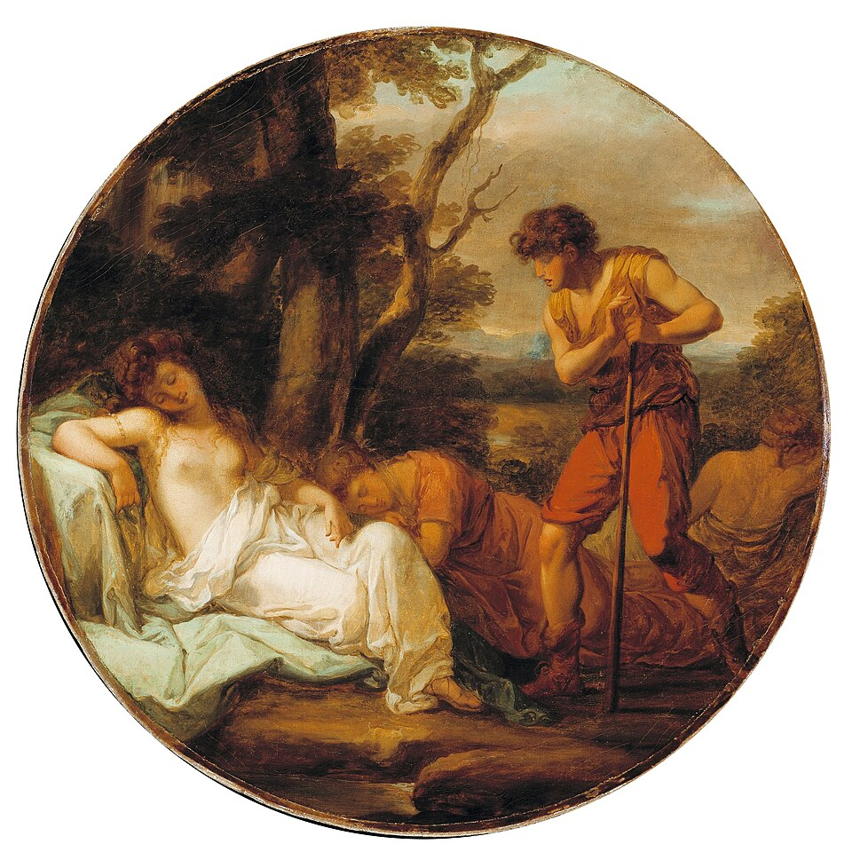
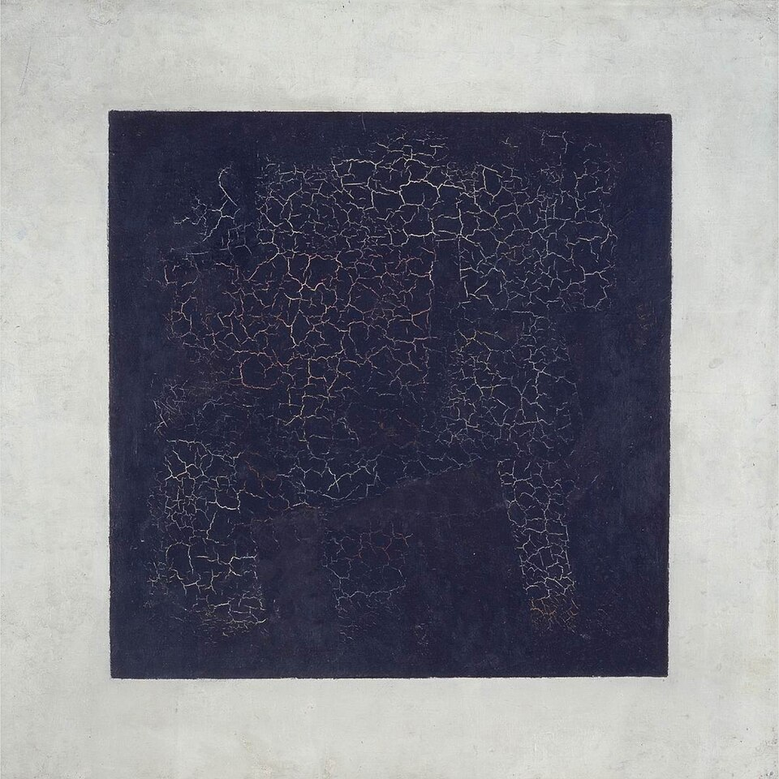
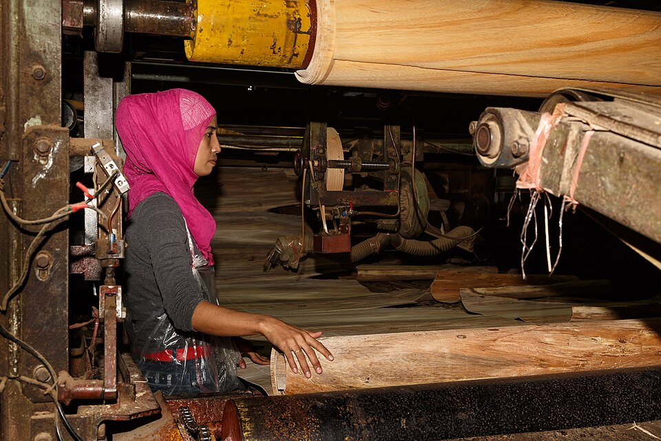
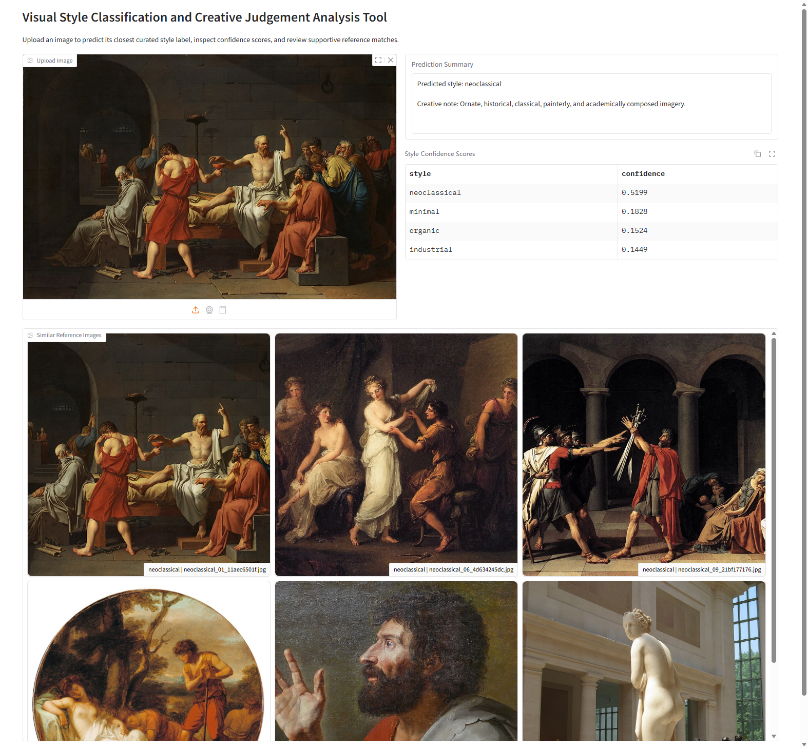
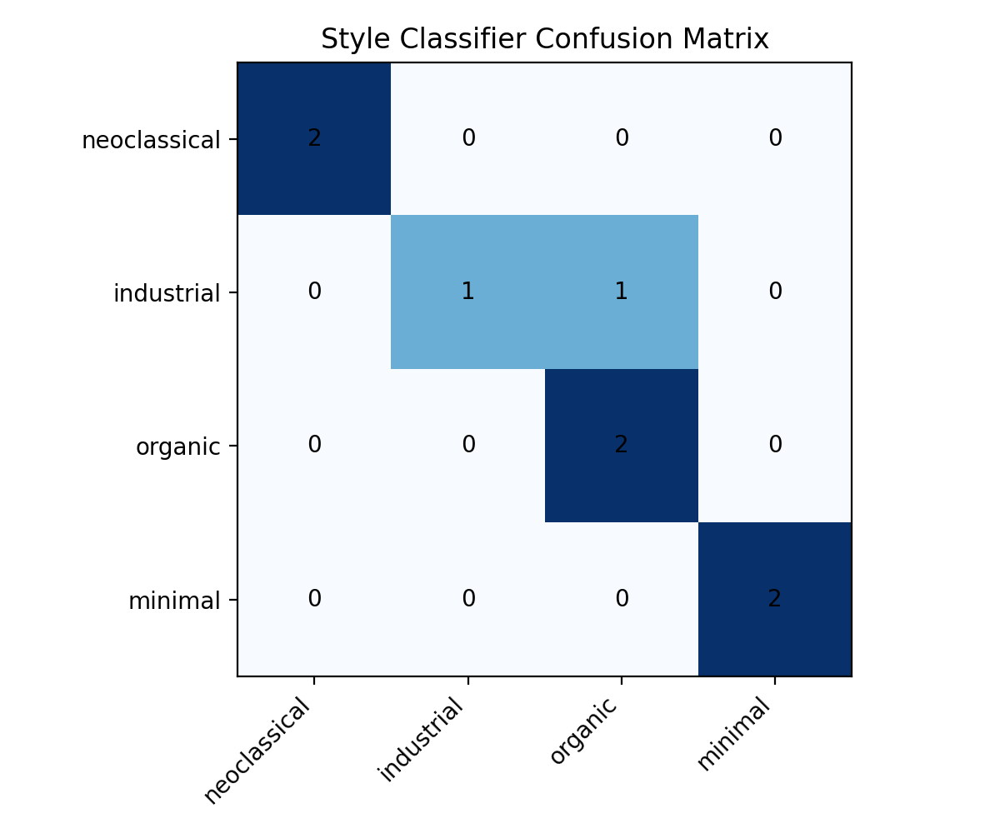

# EMI 2026 Final Project Weblog

This weblog records the iterative development of my final project: **Visual Style Classification and Creative Judgement Analysis Tool**.

## 2026-06-01 - Choosing a clearer direction

At the beginning I knew I wanted to do something with machine learning and visual style, but the phrase "AI art style project" was still too broad. I spent some time narrowing the direction and decided that the most interesting version would not just predict a label for its own sake. I wanted a project that could still operate as a small creative tool while also leaving room for critical reflection.

That led me to a classification-based idea, but with a different emphasis from a normal benchmark task. Instead of claiming that the machine could discover the true meaning of style, I wanted to test whether a small model could sort images into human-defined visual groups and expose where that judgement breaks down.

## 2026-06-02 - Writing the project question

Once the general direction was set, I rewrote the project question several times. The most useful version became: how can a small machine-learning system classify subjective visual style categories without pretending that aesthetic judgement is objective or fixed?

This question immediately helped the rest of the project. It pushed me to think not only about accuracy, but also about the politics of labelling, ambiguity, and how interface design can make a model seem more certain than it really is.

## 2026-06-03 - Defining the four style categories

I settled on four categories: `neoclassical`, `industrial`, `organic`, and `minimal`. I chose them because they are broad enough to feel relevant to visual culture and design research, but still different enough to support a small prototype. At the same time, they are clearly interpretive labels rather than natural kinds, which makes them good material for critique.

Below are a few examples that helped me think through how different the visual directions could be:

Even at this stage I could already see one limitation: some images felt easy to assign, while others would inevitably sit near the boundary between two labels.

## 2026-06-04 - Planning the dataset strategy

After deciding on the labels, I chose to build a small curated starter dataset rather than pretend to have a large neutral archive. For a course project, a smaller dataset has advantages: it is easier to inspect, easier to explain, and easier to connect back to the actual choices I made during development.

I focused on public-domain and open-license sources so that the project would stay practical and ethically cleaner. I also wanted the image provenance to be understandable, because using cultural or design imagery without context would weaken the critical side of the project.

## 2026-06-05 - Choosing the model setup

The next key decision was the machine-learning method. I chose CLIP embeddings plus a lightweight Logistic Regression classifier rather than training a full image model from scratch. This gave me a strong pretrained representation while keeping the training process cheap and interpretable.

I liked this approach because it made the workflow easier to discuss: the project becomes a question of label design, data curation, embedding quality, classifier behaviour, and evaluation. That felt much more appropriate for the assignment than treating the whole system as a black box.

## 2026-06-06 - Building the pipeline scripts

At this point I split the project into separate scripts: downloading images, preparing the dataset, training the classifier, and evaluating the result. I wanted the path from raw images to final output to remain visible rather than collapsing into one oversized notebook or one fragile script.

This structure also made debugging much easier. When something went wrong, I could isolate whether the issue was in the image source stage, the split generation stage, the embedding stage, or the classifier stage.

## 2026-06-08 - Balancing the small dataset

A practical problem appeared quite quickly: some categories were easier to fill with public examples than others. In the end I decided that the final coursework version should rely on the sourced images I had available rather than on synthetic filler images. That meant accepting a small class imbalance in exchange for a cleaner and more defensible dataset.

This became an important lesson in itself. With a tiny dataset, curation decisions are part of the model. The system does not simply learn "style"; it learns from the exact visual world I have assembled for it.

## 2026-06-10 - Building the first interactive prototype

Once the core pipeline was working, I built an early interactive prototype to test the outputs in a more human way. What I cared about most was not a single label alone, but whether the result could be interpreted through supporting information such as confidence scores and nearby reference images.

This was the first prototype view I used during development:

The prototype was useful because it showed me that the project needed explanation as much as prediction. If the interface only displayed a label, the system would look more confident and more simplistic than it really was.

## 2026-06-12 - Evaluation and ambiguity

After the model was stable enough to test, I ran the evaluation scripts and reviewed the confusion matrix. On the current starter dataset, the held-out accuracy reached `0.857`. For such a small experiment, that still felt encouraging, but the more important result was where the errors occurred.

The confusion matrix made one ambiguity especially clear: one `industrial` sample was misclassified as `organic`.

I found this more interesting than disappointing. It suggests that the classifier may be relying on local textures, shapes, or materials that cross the conceptual line I was trying to draw. In other words, the error is part of the project argument, not just a flaw to hide.

## 2026-06-15 - Reworking the interface as a desktop app

During later testing, I decided that the project would work better as a local desktop application than as a browser-based demo. A local app removed port issues and made the final interaction feel more self-contained. It also made the classification project feel more distinct in its presentation and more appropriate for a straightforward recorded demonstration.

This redesign changed the final shape of the interface. The completed version now has three sections: `Classification Lab`, `Evaluation Snapshot`, and `Category Guide`. That structure makes the project easier to present because the prediction, evidence, and critical framing are all visible in one place.

## 2026-06-17 - Packaging the repository

As the project became more stable, I shifted from exploration to packaging. I cleaned the repository so that the important submission-facing files would be easy to find: the code, the README, the weblog, the run instructions, and the evaluation outputs. I also made sure the run path was short and explainable.

This stage felt less glamorous than model building, but it mattered a lot. A course project is judged not only by what it can do, but also by whether another person can understand the workflow, repeat the main steps, and inspect the evidence.

## 2026-06-19 - Final reflection

At the final stage I think the project achieved what I wanted most: a small machine-learning system that works as a practical experiment without pretending to be neutral. It does classify images into curated visual categories, but it also exposes how fragile and constructed those categories can be.

The strongest part of the project is its coherence. The data curation, CLIP-based representation, lightweight classifier, evaluation outputs, and final desktop interface all support the same research question. The weakest part is the limited scale of the dataset, which means that many results still depend heavily on the particular images I chose.

If I continued the work, I would expand the dataset, collect more edge-case examples near category boundaries, and explore a preference or reward layer that could rank references more intelligently. Even in its current form, though, I think it succeeds as a final coursework project because it combines implementation, evaluation, and critical reflection in a single workflow.
